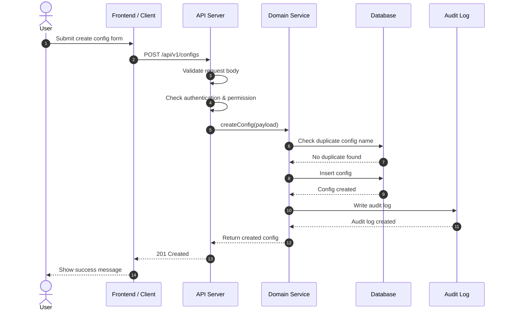
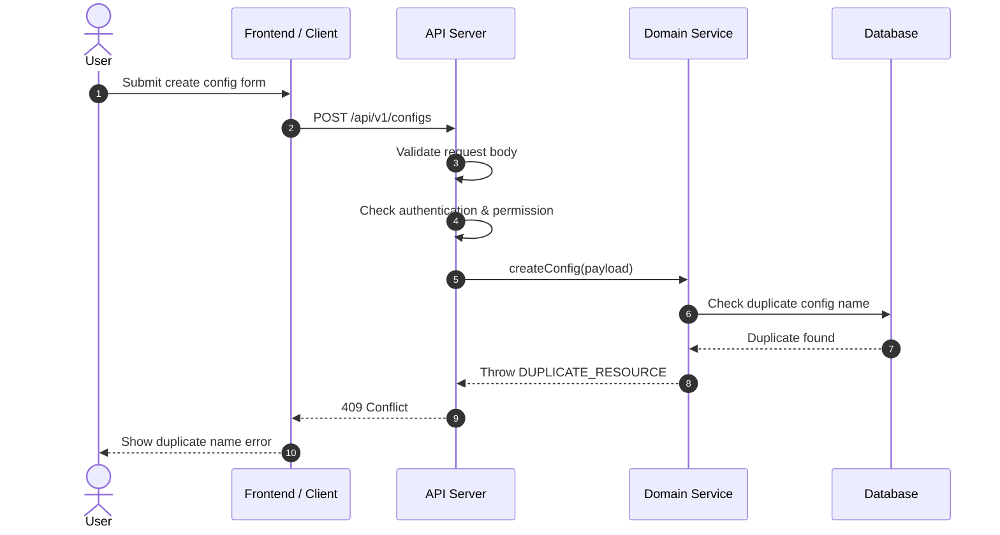
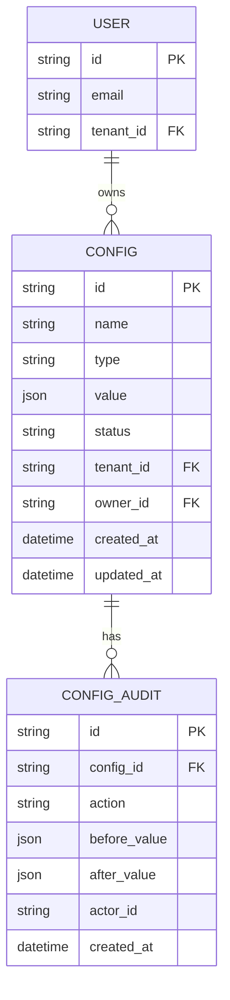

# 🔌 API Spec: `<Feature / Resource Name>`

## 🎯 1. Overview

### Purpose

อธิบายว่า API นี้มีไว้ทำอะไร และแก้ปัญหาอะไร

```md
Example:
ใช้สำหรับให้ Admin สามารถจัดการ configuration ของระบบ เช่น create, update, publish, rollback config
```

### Scope

* ✅ In scope:

  * `<action 1>`
  * `<action 2>`
* ❌ Out of scope:

  * `<thing not covered>`

### Related Documents

* 📄 Product Spec: `<link>`
* 🎨 UI Spec: `<link>`
* 🗄️ Database Spec: `<link>`
* 🔄 Sequence Diagram: `<link>`

---

## 👤 2. Actors & Permissions

| Actor       | Permission       | Description        |
| ----------- | ---------------- | ------------------ |
| Admin       | `config:read`    | อ่าน config        |
| Admin       | `config:write`   | สร้าง/แก้ไข config |
| Super Admin | `config:publish` | publish config     |

### 🔐 Authorization Rule

```md
- User must be authenticated
- User must have `<permission>`
- Tenant / organization scope must match request context
```

---

## 🗂️ 3. API Summary

| Method | Endpoint              | Description       | Auth     |
| ------ | --------------------- | ----------------- | -------- |
| GET    | `/api/v1/configs`     | List configs      | Required |
| GET    | `/api/v1/configs/:id` | Get config detail | Required |
| POST   | `/api/v1/configs`     | Create config     | Required |
| PATCH  | `/api/v1/configs/:id` | Update config     | Required |
| DELETE | `/api/v1/configs/:id` | Delete config     | Required |

---

## 🔄 4. Sequence Diagram

> ใช้ section นี้เพื่ออธิบาย flow หลักของ API
> โดยเฉพาะ endpoint ที่มี validation, permission, business rule, database transaction, audit log, external service หรือ async job

### ✅ Happy Path: `<Flow Name>`



### ❌ Failure Path: Duplicate Resource



### 📝 Sequence Notes

* ✅ Happy path ต้องแสดง flow หลักที่คาดหวัง
* ❌ Failure path ต้องแสดง error สำคัญที่กระทบ UX หรือ business rule
* 🔐 Permission check ควรระบุให้ชัดว่าเกิดที่ API layer หรือ service layer
* 🧾 Audit log ควรอยู่ใน flow เมื่อ action นั้นเปลี่ยนข้อมูลสำคัญ
* 📬 External service / queue / webhook ต้องระบุ participant แยก

---

## 🗄️ 5. Database & ER Diagram

> แสดง schema ที่ feature นี้แตะต้อง พร้อม **state tag** ว่าแต่ละ table/column เป็นของใหม่หรือแก้ไขจากเดิม
> เป้าหมาย: ให้ผู้อ่าน (และ agent ที่ execute plan) รู้ทันทีว่าต้องสร้าง migration อะไรบ้าง

### State Legend

| Tag             | Meaning                                  |
| --------------- | ---------------------------------------- |
| 🆕 `NEW`        | Table / column สร้างใหม่                 |
| ✏️ `MODIFIED`   | Table เดิม แต่มีการเพิ่ม/แก้ column      |
| ⬜ `UNCHANGED`  | Table เดิม ใส่ไว้เพื่อแสดง relationship  |
| 🗑️ `DEPRECATED` | Table / column ที่จะเลิกใช้ / ลบ         |

### ER Diagram

> ใช้ comment `%% 🆕 NEW` / `%% ✏️ MODIFIED` กำกับ entity และ prefix field ที่เปลี่ยนด้วย `+` (new) หรือ `~` (modified)



### Schema Change State

| Table          | State         | Reason / Notes                                  |
| -------------- | ------------- | ----------------------------------------------- |
| `CONFIG`       | ✏️ `MODIFIED` | เพิ่ม column `status`, `owner_id`               |
| `CONFIG_AUDIT` | 🆕 `NEW`      | เก็บ audit trail ของการเปลี่ยน config           |
| `USER`         | ⬜ `UNCHANGED` | อ้างถึงเพื่อแสดง relationship เท่านั้น           |

### Column Change Detail (เฉพาะ table ที่ 🆕 NEW / ✏️ MODIFIED)

| Table          | Column         | Type     | State         | Constraint / Note                         |
| -------------- | -------------- | -------- | ------------- | ----------------------------------------- |
| `CONFIG`       | `status`       | string   | 🆕 `NEW`      | enum `draft/published/archived`, default `draft` |
| `CONFIG`       | `owner_id`     | string   | 🆕 `NEW`      | FK → `USER.id`, nullable                  |
| `CONFIG_AUDIT` | `id`           | string   | 🆕 `NEW`      | PK                                        |
| `CONFIG_AUDIT` | `config_id`    | string   | 🆕 `NEW`      | FK → `CONFIG.id`, indexed                 |
| `CONFIG_AUDIT` | `action`       | string   | 🆕 `NEW`      | `create/update/publish/delete`            |
| `CONFIG_AUDIT` | `before_value` | json     | 🆕 `NEW`      | nullable                                  |
| `CONFIG_AUDIT` | `after_value`  | json     | 🆕 `NEW`      | nullable                                  |

### Migration Notes

* 🔁 Migration ต้อง backward-compatible: เพิ่ม column ใหม่เป็น nullable หรือมี default ก่อน backfill
* 🧱 ระบุ index ที่ต้องสร้าง (FK, unique, composite) ให้ชัด
* 🗑️ ถ้ามี `DEPRECATED` ต้องแยก migration เป็น 2 เฟส (stop-write → drop)
* 🧪 ทุก migration ต้องมี rollback / down script

---

## 🧩 6. Endpoint Detail

## `POST /api/v1/<resource>`

### Description

อธิบาย endpoint นี้แบบชัด ๆ ว่าใช้เมื่อไหร่

```md
Example:
ใช้สำหรับสร้าง config ใหม่ในสถานะ draft ก่อนนำไป publish
```

---

### 📥 Request Headers

| Header            |    Required | Example          | Description                              |
| ----------------- | ----------: | ---------------- | ---------------------------------------- |
| `Authorization`   |         Yes | `Bearer <token>` | Access token                             |
| `X-Request-ID`    |          No | `req_123`        | Request tracing                          |
| `Idempotency-Key` | Conditional | `idem_123`       | Required for retry-safe create operation |

---

### 🧭 Path Parameters

| Name | Type   | Required | Description |
| ---- | ------ | -------: | ----------- |
| `id` | string |      Yes | Resource ID |

---

### 🔍 Query Parameters

| Name     | Type   | Required | Default | Description      |
| -------- | ------ | -------: | ------- | ---------------- |
| `page`   | number |       No | `1`     | Page number      |
| `limit`  | number |       No | `20`    | Items per page   |
| `status` | string |       No | -       | Filter by status |

---

### 📦 Request Body

```json
{
  "name": "payment_timeout",
  "type": "number",
  "value": 30,
  "description": "Timeout in seconds",
  "isActive": true
}
```

### 📐 Request Schema

| Field         | Type    | Required | Validation                                                                 | Description                |
| ------------- | ------- | -------: | -------------------------------------------------------------------------- | -------------------------- |
| `name`        | string  |      Yes | `1-100 chars`, unique                                                      | Config key                 |
| `type`        | enum    |      Yes | `string`, `boolean`, `number`, `float`, `double`, `big`, `object`, `array` | Value type                 |
| `value`       | unknown |      Yes | Must match `type`                                                          | Config value               |
| `description` | string  |       No | Max `500 chars`                                                            | Human-readable description |
| `isActive`    | boolean |       No | Default `true`                                                             | Active status              |

---

## 📏 7. Business Rules

| Rule ID | Rule                                                    |
| ------- | ------------------------------------------------------- |
| BR-001  | `name` must be unique within tenant scope               |
| BR-002  | `value` must match selected `type`                      |
| BR-003  | Published config cannot be deleted directly             |
| BR-004  | Update must create audit log                            |
| BR-005  | Object and array values must be valid JSON              |
| BR-006  | Big number values must be stored without precision loss |

---

## ✅ 8. Response

### Success Response

Status: `201 Created`

```json
{
  "id": "cfg_123",
  "name": "payment_timeout",
  "type": "number",
  "value": 30,
  "status": "draft",
  "createdAt": "2026-06-14T10:00:00.000Z",
  "updatedAt": "2026-06-14T10:00:00.000Z"
}
```

### Response Schema

| Field       | Type         | Description       |
| ----------- | ------------ | ----------------- |
| `id`        | string       | Resource ID       |
| `name`      | string       | Config key        |
| `type`      | string       | Config value type |
| `value`     | unknown      | Config value      |
| `status`    | string       | Current status    |
| `createdAt` | ISO datetime | Created timestamp |
| `updatedAt` | ISO datetime | Updated timestamp |

---

## ❌ 9. Error Handling

### Error Response Format

```json
{
  "error": {
    "code": "VALIDATION_ERROR",
    "message": "Invalid request body",
    "details": [
      {
        "field": "name",
        "message": "name is required"
      }
    ]
  }
}
```

### Error Cases

| HTTP Status | Code                      | Cause                   | User-facing Message        |
| ----------: | ------------------------- | ----------------------- | -------------------------- |
|         400 | `VALIDATION_ERROR`        | Invalid request body    | Please check your input    |
|         401 | `UNAUTHORIZED`            | Missing/invalid token   | Please login again         |
|         403 | `FORBIDDEN`               | Missing permission      | You do not have permission |
|         404 | `RESOURCE_NOT_FOUND`      | Resource does not exist | Data not found             |
|         409 | `DUPLICATE_RESOURCE`      | Name already exists     | This name is already used  |
|         422 | `BUSINESS_RULE_VIOLATION` | Business rule failed    | This action is not allowed |
|         500 | `INTERNAL_ERROR`          | Unexpected server error | Something went wrong       |

---

## 📄 10. Pagination

ใช้เมื่อ endpoint เป็น list

### Request

```http
GET /api/v1/configs?page=1&limit=20
```

### Response

```json
{
  "data": [],
  "pagination": {
    "page": 1,
    "limit": 20,
    "total": 100,
    "totalPages": 5
  }
}
```

---

## 🔍 11. Sorting & Filtering

| Parameter   | Supported Values                 | Description      |
| ----------- | -------------------------------- | ---------------- |
| `sortBy`    | `createdAt`, `updatedAt`, `name` | Sort field       |
| `sortOrder` | `asc`, `desc`                    | Sort direction   |
| `status`    | `draft`, `published`, `archived` | Filter by status |

---

## 🔐 12. Security Considerations

* Authentication required: `Yes / No`
* Authorization required: `Yes / No`
* PII involved: `Yes / No`
* Sensitive data involved: `Yes / No`
* Audit log required: `Yes / No`
* Rate limit required: `Yes / No`
* Idempotency required: `Yes / No`
* Tenant isolation required: `Yes / No`

---

## 📊 13. Observability

### Logs

ต้อง log อะไรบ้าง

* `requestId`
* `userId`
* `tenantId`
* `resourceId`
* `action`
* `status`
* `errorCode`
* `durationMs`

### Metrics

| Metric                       | Description                |
| ---------------------------- | -------------------------- |
| `api_request_total`          | Total API requests         |
| `api_request_duration_ms`    | Request latency            |
| `api_error_total`            | Total API errors           |
| `api_validation_error_total` | Total validation errors    |
| `api_business_error_total`   | Total business rule errors |

---

## 🧪 14. Test Cases

### Unit Tests

* Validate required fields
* Validate enum values
* Validate business rules
* Validate permission logic
* Validate value type matching

### Integration Tests

* Create resource success
* Duplicate name returns `409`
* Unauthorized request returns `401`
* Forbidden request returns `403`
* Invalid body returns `400`
* Business rule violation returns `422`

### Contract Tests

* Request schema matches API spec
* Response schema matches API spec
* Error format is consistent
* HTTP status code matches expected behavior

---

## ✔️ 15. Acceptance Criteria

* [ ] API validates request correctly
* [ ] API returns consistent response shape
* [ ] API handles expected error cases
* [ ] API enforces authentication
* [ ] API enforces authorization
* [ ] API protects tenant scope
* [ ] API writes audit log where required
* [ ] API has unit/integration/contract tests
* [ ] API is documented in OpenAPI/Swagger
* [ ] Sequence diagram reflects actual business flow
* [ ] Failure path is documented for important business cases
