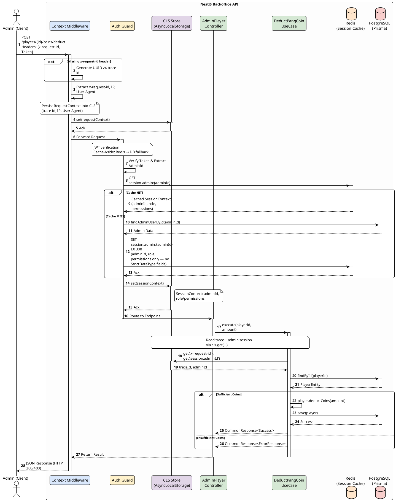

# API Specification & Context Architecture

**Project:** MVP Game Backoffice API  
**Stack:** NestJS, Prisma, PostgreSQL, Redis

---

## 1. Context Management (CLS Concept)

ระบบจะใช้ Continuation-Local Storage (CLS) ผ่าน `nestjs-cls` เพื่อหลีกเลี่ยงการทำ Prop Drilling (การส่งพารามิเตอร์ต่อๆ กันไปในทุกฟังก์ชัน)

Context จะถูกแบ่งออกเป็น 2 ระดับ:

### 1.1 RequestContext (Middleware Level)

ทำงานตั้งแต่ Request วิ่งเข้ามาถึงเซิร์ฟเวอร์ โดยจะเก็บข้อมูลพื้นฐานของ HTTP Request

- **x-request-id (Trace ID):** ดึงจาก Header `x-request-id` หากไม่มี ระบบจะสร้าง UUID V4 ขึ้นมาใหม่
- **IP Address:** ไอพีต้นทางที่ยิง Request
- **User-Agent:** ข้อมูลเบราว์เซอร์หรืออุปกรณ์

### 1.2 SessionContext (Guard Level)

ทำงานในชั้น Authentication Guard หลังจากแกะ JWT Token สำเร็จ โดยใช้ **Cache-Aside Pattern** ผ่าน Redis เพื่อหลีกเลี่ยงการยิง DB ทุก Request

- **User ID:** รหัสของผู้ใช้งาน (Admin) ที่ยืนยันตัวตนแล้ว
- **Role/Permissions:** สิทธิ์การใช้งาน — โหลดจาก Redis Cache ก่อน ถ้า miss ค่อยดึงจาก Database แล้ว write กลับเข้า Cache

#### Cache Strategy

| Item | ค่า |
| :--- | :--- |
| **Cache Key** | `session:admin:{adminId}` |
| **TTL** | 300 วินาที (5 นาที) |
| **Cached Fields** | `adminId`, `role`, `permissions[]` |
| **ห้าม Cache** | `hashedPassword`, `jwtToken`, PII (email, phone) — เป็น `StrictDataType` ตาม `101-sensitive-data.mdc` |

#### Cache Invalidation

ต้อง `DEL session:admin:{adminId}` ทันทีเมื่อเกิดเหตุการณ์ต่อไปนี้:

- เปลี่ยน role / permissions ของ Admin
- Reset password
- Ban / Suspend account

*เมื่อนำข้อมูลเข้า CLS Store แล้ว ชั้น Use Case และ Repository จะสามารถเรียกใช้ค่าเหล่านี้ได้ทันทีผ่าน `cls.get()`*

---

## 2. API Specification

**Feature:** Deduct Pang Coin (ตัดเงินผู้เล่น)

- **Method:** `POST`
- **Endpoint:** `/api/v1/admin/players/{playerId}/coins/deduct`
- **Description:** ตัดเหรียญ Pang Coin ของผู้เล่นตามจำนวนที่ระบุ (สำหรับ Admin)

### 2.1 Request Headers

| Key | Type | Required | Description |
| :--- | :--- | :---: | :--- |
| `Authorization` | String | Yes | Bearer Token ของ Admin |
| `x-request-id` | String | No | Trace ID สำหรับติดตาม Log |
| `User-Agent` | String | Yes | ข้อมูลอุปกรณ์ที่เรียก API |

### 2.2 Path Parameters

| Key | Type | Required | Description |
| :--- | :--- | :---: | :--- |
| `playerId` | String (UUID) | Yes | ไอดีของผู้เล่นเป้าหมาย |

### 2.3 Request Body (application/json)

```json
{
  "amount": 500,
  "reason": "buy_item_001"
}
```

### 2.4 Responses

**Success - 200 OK**

```json
{
  "success": true,
  "status": 200,
  "message": "success",
  "traceId": "req-1234-abcd",
  "timestamp": "2026-05-10T10:50:41.000Z",
  "body": {
    "id": "player-uuid-1234",
    "name": "Marut",
    "pangCoin": 1500
  }
}
```

**Error - 400 Bad Request (Insufficient Funds)**

```json
{
  "success": false,
  "status": 400,
  "message": "Insufficient Pang Coins for this transaction.",
  "error": "PLAYER_1002",
  "traceId": "req-1234-abcd",
  "timestamp": "2026-05-10T10:50:41.000Z"
}
```

---

## 3. Sequence Diagram

Flow การทำงานตั้งแต่ Client ยิง Request จนถึงการคืนค่าด้วย CommonResponse


