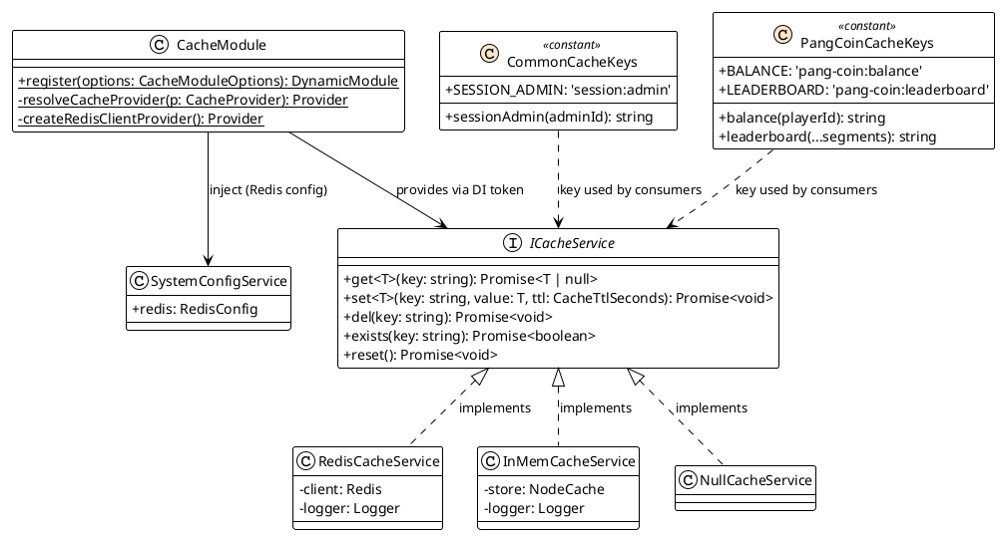
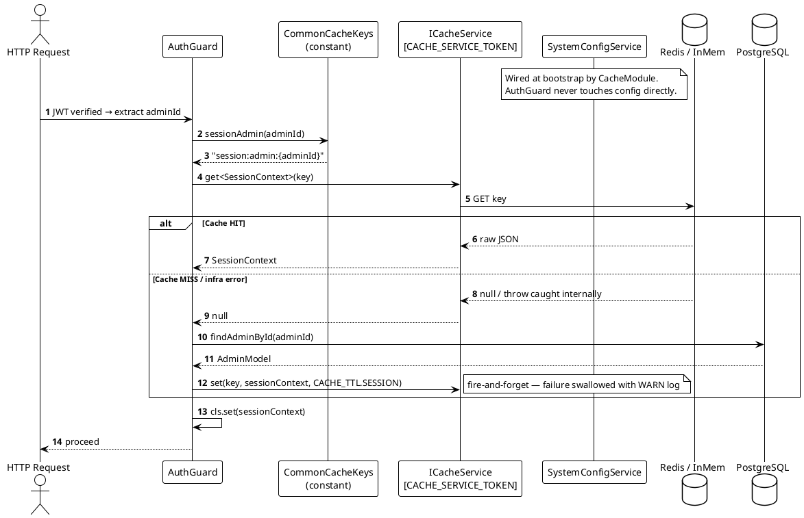

# Cache Module Specification

**Project:** MVP Game Backoffice API  
**Stack:** NestJS · TypeScript (strict) · Redis (`ioredis`) · `@nestjs/config` → `SystemConfigService`

---

## 1. Goals & Design Principles

| Goal | Decision |
| :--- | :--- |
| **Pluggability** | Consumer depends only on `ICacheService` token — never on `ioredis` / `node-cache` directly |
| **Config isolation** | Redis connection details flow exclusively through `SystemConfigService` — no hardcoded env reads |
| **Key discipline** | Every key string lives in a typed constant file scoped to its domain — no raw strings in business code |
| **Maintainability** | Swap cache provider via one `provider` flag in `CacheModule.register()` |
| **Testability** | `NullCacheService` (Null Object) replaces real cache in unit tests with zero `vi.mock()` |
| **Fail-safe** | Cache failures never throw — graceful degradation with `WARN` log only |

---

## 2. Design Patterns

| Pattern | Applied To | Why |
| :--- | :--- | :--- |
| **Strategy** | `ICacheService` + 3 concrete implementations | Decouples caller from provider |
| **Adapter** | `RedisCacheService`, `InMemCacheService` | Wraps third-party API behind the common interface |
| **Null Object** | `NullCacheService` | Removes all mock boilerplate in unit tests |
| **Factory Method** | `CacheModule.register(options)` | Selects and registers the correct strategy at DI boot |
| **Constant Object** | `*CacheKeys` per domain | Typed, composable key definitions without class instantiation |

---

## 3. Directory Structure

```
src/
├── shared/
│   ├── configuration/
│   │   ├── system-config.service.ts       ← provides redis, app config — imported by CacheModule
│   │   └── configuration.module.ts
│   │
│   └── cache/
│       ├── interfaces/
│       │   └── i-cache.service.ts
│       ├── services/
│       │   ├── redis-cache.service.ts
│       │   ├── in-mem-cache.service.ts
│       │   └── null-cache.service.ts
│       ├── constants/
│       │   ├── cache-keys/
│       │   │   └── common.cache-keys.const.ts   ← shared / auth session keys
│       │   └── cache.const.ts                   ← TTL branded values, DI tokens
│       ├── types/
│       │   └── cache.type.ts
│       └── cache.module.ts
│
└── modules/
    └── [domain]/                           ← e.g. pang-coin, player
        └── constants/
            └── cache-keys/
                └── [domain].cache-keys.const.ts  ← domain-specific keys
```

> **Rule:** Domain modules own their own cache key files. `src/shared/cache/constants/cache-keys/` holds only cross-cutting keys (auth session, etc.). No domain key bleeds into `shared/`.

---

## 4. Types

```typescript
// src/shared/cache/types/cache.type.ts

export type CacheProvider = 'redis' | 'in-mem' | 'null';

declare const __cacheTtlBrand: unique symbol;
export type CacheTtlSeconds = number & { readonly [__cacheTtlBrand]: 'CacheTtlSeconds' };

export function asCacheTtl(seconds: number): CacheTtlSeconds {
  return seconds as CacheTtlSeconds;
}

export interface CacheModuleOptions {
  provider: CacheProvider;
}
```

---

## 5. Constants

```typescript
// src/shared/cache/constants/cache.const.ts

export const CACHE_SERVICE_TOKEN = 'ICacheService' as const;
export const REDIS_CLIENT_TOKEN  = 'REDIS_CLIENT'  as const;

export const CACHE_TTL = {
  SESSION: asCacheTtl(300),
  SHORT:   asCacheTtl(60),
  MEDIUM:  asCacheTtl(600),
  LONG:    asCacheTtl(3600),
} as const;
```

---

## 6. Cache Key Constants — Domain-Separated Pattern

### Pattern Rules

| Rule | Detail |
| :--- | :--- |
| Static keys | Literal string `'namespace:entity' as const` |
| Dynamic keys | Function that composes from the static prefix + runtime params |
| Params | Array `...segments: string[]` or typed individual args |
| Composition | Dynamic keys MUST reference the constant static prefix — no duplicated string literals |
| Placement | One file per domain under that domain's `constants/cache-keys/` folder |

### 6.1 Shared / Auth Keys

```typescript
// src/shared/cache/constants/cache-keys/common.cache-keys.const.ts

export const CommonCacheKeys = {
  SESSION_ADMIN: 'session:admin' as const,

  sessionAdmin: (adminId: string) =>
    `${CommonCacheKeys.SESSION_ADMIN}:${adminId}`,
} as const;

// Usage:
// CommonCacheKeys.SESSION_ADMIN              → "session:admin"
// CommonCacheKeys.sessionAdmin('uuid-1234')  → "session:admin:uuid-1234"
```

### 6.2 Domain-Specific Keys (example: Pang Coin)

```typescript
// src/modules/pang-coin/constants/cache-keys/pang-coin.cache-keys.const.ts

export const PangCoinCacheKeys = {
  BALANCE:     'pang-coin:balance'      as const,
  LEADERBOARD: 'pang-coin:leaderboard'  as const,

  balance: (playerId: string) =>
    `${PangCoinCacheKeys.BALANCE}:${playerId}`,

  leaderboard: (...segments: string[]) =>
    `${PangCoinCacheKeys.LEADERBOARD}:${segments.join(':')}`,
} as const;

// Usage:
// PangCoinCacheKeys.balance('player-99')           → "pang-coin:balance:player-99"
// PangCoinCacheKeys.leaderboard('global', 'top10') → "pang-coin:leaderboard:global:top10"
```

### 6.3 Adding a New Domain

When a new feature needs caching:

1. Create `src/modules/{domain}/constants/cache-keys/{domain}.cache-keys.const.ts`
2. Follow the same static-prefix + function-composer pattern
3. Never import a domain's keys from another domain — go through `ICacheService` only

---

## 7. `ICacheService` Interface

```typescript
// src/shared/cache/interfaces/i-cache.service.ts

export interface ICacheService {
  get<T>(key: string): Promise<T | null>;
  set<T>(key: string, value: T, ttl: CacheTtlSeconds): Promise<void>;
  del(key: string): Promise<void>;
  exists(key: string): Promise<boolean>;
  reset(): Promise<void>;
}
```

**Contract:**

- `get()` returns `null` on both cache-miss AND infrastructure error — callers treat both identically
- `set()` / `del()` silently swallow errors (log `WARN`, never throw)
- `reset()` is guarded for test/maintenance only — forbidden in request path

---

## 8. Implementations

### 8.1 `RedisCacheService`

```typescript
// src/shared/cache/services/redis-cache.service.ts

@Injectable()
export class RedisCacheService implements ICacheService {
  private readonly logger = new Logger(RedisCacheService.name);

  constructor(@Inject(REDIS_CLIENT_TOKEN) private readonly client: Redis) {}

  async get<T>(key: string): Promise<T | null> {
    try {
      const raw = await this.client.get(key);
      return raw === null ? null : (JSON.parse(raw) as T);
    } catch (err) {
      this.logger.warn({ key, err }, 'Cache GET failed — miss fallback');
      return null;
    }
  }

  async set<T>(key: string, value: T, ttl: CacheTtlSeconds): Promise<void> {
    try {
      await this.client.set(key, JSON.stringify(value), 'EX', ttl);
    } catch (err) {
      this.logger.warn({ key, ttl, err }, 'Cache SET failed — skipped');
    }
  }

  async del(key: string): Promise<void> {
    try {
      await this.client.del(key);
    } catch (err) {
      this.logger.warn({ key, err }, 'Cache DEL failed');
    }
  }

  async exists(key: string): Promise<boolean> {
    try {
      return (await this.client.exists(key)) === 1;
    } catch {
      return false;
    }
  }

  async reset(): Promise<void> {
    await this.client.flushdb();
  }
}
```

### 8.2 `InMemCacheService`

```typescript
// src/shared/cache/services/in-mem-cache.service.ts

@Injectable()
export class InMemCacheService implements ICacheService {
  private readonly logger = new Logger(InMemCacheService.name);
  private readonly store = new NodeCache({ useClones: false });

  async get<T>(key: string): Promise<T | null> {
    try {
      return this.store.get<T>(key) ?? null;
    } catch (err) {
      this.logger.warn({ key, err }, 'InMem GET failed');
      return null;
    }
  }

  async set<T>(key: string, value: T, ttl: CacheTtlSeconds): Promise<void> {
    try {
      this.store.set(key, value, ttl);
    } catch (err) {
      this.logger.warn({ key, err }, 'InMem SET failed');
    }
  }

  async del(key: string): Promise<void>       { this.store.del(key); }
  async exists(key: string): Promise<boolean> { return this.store.has(key); }
  async reset(): Promise<void>                { this.store.flushAll(); }
}
```

> `InMemCacheService` is process-scoped — not suitable for multi-pod deployments.

### 8.3 `NullCacheService`

```typescript
// src/shared/cache/services/null-cache.service.ts

@Injectable()
export class NullCacheService implements ICacheService {
  async get<T>(_key: string): Promise<T | null>                         { return null; }
  async set<T>(_key: string, _v: T, _ttl: CacheTtlSeconds): Promise<void> {}
  async del(_key: string): Promise<void>                                {}
  async exists(_key: string): Promise<boolean>                          { return false; }
  async reset(): Promise<void>                                          {}
}
```

---

## 9. `CacheModule` — DI Registration with `SystemConfigService`

```typescript
// src/shared/cache/cache.module.ts

@Module({})
export class CacheModule {
  static register(options: CacheModuleOptions): DynamicModule {
    const providers: Provider[] = [
      CacheModule.resolveCacheProvider(options.provider),
    ];

    if (options.provider === 'redis') {
      providers.push(CacheModule.createRedisClientProvider());
    }

    return {
      module: CacheModule,
      imports: [ConfigurationModule],
      providers,
      exports: [CACHE_SERVICE_TOKEN],
    };
  }

  private static createRedisClientProvider(): Provider {
    return {
      provide: REDIS_CLIENT_TOKEN,
      useFactory: (config: SystemConfigService): Redis => {
        const { host, port, password, db } = config.redis;
        return new Redis({ host, port, password, db });
      },
      inject: [SystemConfigService],
    };
  }

  private static resolveCacheProvider(provider: CacheProvider): Provider {
    const map: Record<CacheProvider, Type<ICacheService>> = {
      redis:    RedisCacheService,
      'in-mem': InMemCacheService,
      null:     NullCacheService,
    };
    return { provide: CACHE_SERVICE_TOKEN, useClass: map[provider] };
  }
}
```

**`SystemConfigService` contract (from `ConfigurationModule`):**

```typescript
// src/shared/configuration/system-config.service.ts

@Injectable()
export class SystemConfigService {
  constructor(private readonly config: ConfigService) {}

  get redis() {
    return {
      host:     this.config.getOrThrow<string>('REDIS_HOST'),
      port:     this.config.getOrThrow<number>('REDIS_PORT'),
      password: this.config.get<string>('REDIS_PASSWORD'),
      db:       this.config.get<number>('REDIS_DB', 0),
    };
  }
}
```

**Registration examples:**

```typescript
// AppModule — production
CacheModule.register({ provider: 'redis' })

// Local dev
CacheModule.register({ provider: 'in-mem' })

// Unit test module
CacheModule.register({ provider: 'null' })
```

---

## 10. Cache Invalidation

| Trigger | Action | Location |
| :--- | :--- | :--- |
| Admin role / permissions changed | `cache.del(CommonCacheKeys.sessionAdmin(adminId))` | Use Case — after DB write |
| Admin password reset | `cache.del(CommonCacheKeys.sessionAdmin(adminId))` | Use Case — after DB write |
| Admin banned / suspended | `cache.del(CommonCacheKeys.sessionAdmin(adminId))` | Use Case — after DB write |

---

## 11. Class Diagram



---

## 12. Sequence Diagram — Cache-Aside (Auth Guard)



---

## 13. Testing Guidance

| Scope | Strategy | Coverage Target |
| :--- | :--- | :--- |
| `RedisCacheService` | Integration with `ioredis-mock`; cover HIT, MISS, infra-down (reject all calls) | 80%+ |
| `InMemCacheService` | Unit: roundtrip, TTL expiry, concurrent keys | 80%+ |
| `NullCacheService` | Skip — trivial no-op | — |
| `CommonCacheKeys` | Unit: every static literal + every composer function | **100%** |
| Domain `*CacheKeys` | Unit: every static literal + every composer function | **100%** |
| Guards / Use Cases | Inject `NullCacheService`; assert DB fallback path + invalidation calls | 80%+ |
