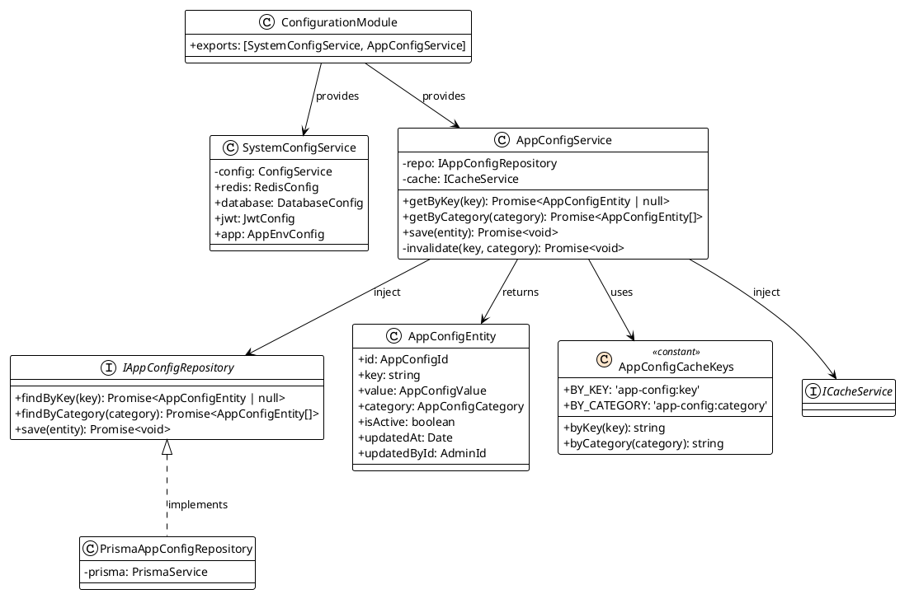
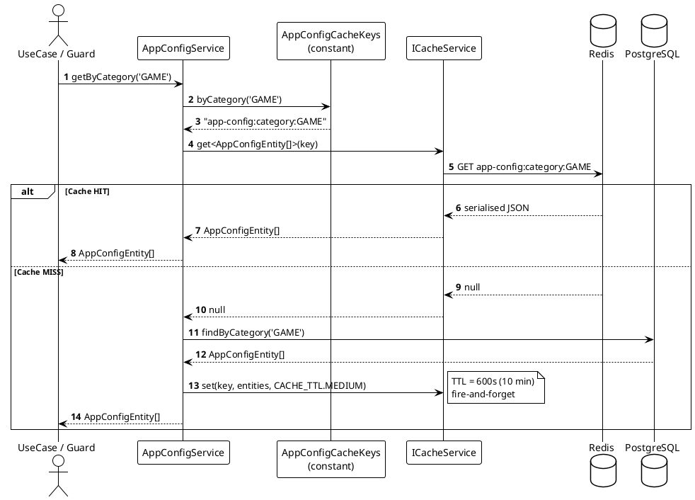
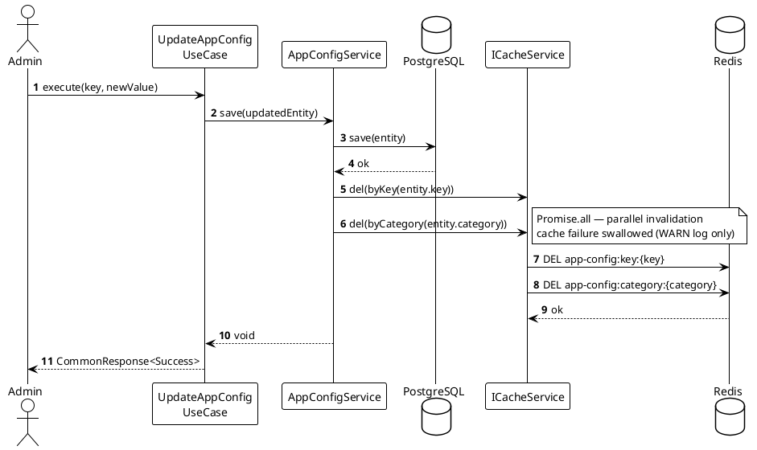

# Configuration Module Specification

**Project:** MVP Game Backoffice API  
**Stack:** NestJS · TypeScript (strict) · PostgreSQL (Prisma) · Redis (Cache-Aside)

---

## 1. Module Responsibility Split

```
ConfigurationModule
├── SystemConfigService   → env vars only (Redis DSN, JWT secret, DB URL, etc.)
└── AppConfigService      → dynamic config stored in DB (game rules, admin menu, feature flags)
```

| | SystemConfigService | AppConfigService |
| :--- | :--- | :--- |
| **Source of truth** | `process.env` via `ConfigService` | PostgreSQL via `IAppConfigRepository` |
| **Changes when** | App restarts | Admin updates at runtime |
| **DB access** | None | Yes (Cache-Aside: Redis → DB) |
| **Read frequency** | Once at DI bootstrap | Every feature that reads config |
| **Sensitive values** | Yes (`StrictDataType`) | No |
| **Cache** | Not needed | Redis Cache-Aside |

---

## 2. Read Replica — Decision Record

> **Decision: No Read Replica for MVP.**

`SystemConfigService` reads env vars only — replica is not applicable (zero DB access).

For `AppConfigService`, Cache-Aside with Redis is architecturally superior:

| Dimension | Cache-Aside (Redis) | Read Replica |
| :--- | :--- | :--- |
| **Read offload** | ✅ ~100% reads served from Redis (config changes rarely) | ✅ Offloads DB reads, but only at DB level |
| **Consistency** | ✅ Invalidation on every write → no stale data | ⚠️ Replication lag (async) → stale config possible |
| **Complexity** | Low — existing Redis already in stack | High — two Prisma clients, separate DSNs, failover logic |
| **Failure modes** | Redis down → fallback to primary DB, app continues | Replica down → needs failover or app degrades |
| **Cost** | Free (Redis already present) | Additional infra node |

**Future trigger signals for reconsideration:**
- Cache miss rate > 20% in production (config invalidation too frequent)
- Primary DB write QPS saturated by game transactions AND config reads compete for connections
- If real-time config (TTL = 0) is needed → prefer Redis Pub/Sub broadcast over replica

---

## 3. Design Patterns

| Pattern | Applied To | Why |
| :--- | :--- | :--- |
| **Facade** | `SystemConfigService` | Single typed surface for all env vars — consumers never call `ConfigService` directly |
| **Repository** | `IAppConfigRepository` | Decouples `AppConfigService` from Prisma |
| **Cache-Aside** | `AppConfigService` | Redis as read layer; DB as source of truth; invalidate on write |
| **Constant Object** | `AppConfigCacheKeys` | Domain-separated cache key pattern (per `02-cache-module` spec) |
| **Value Object** | `AppConfigCategory` | Typed union prevents arbitrary category strings |

---

## 4. Directory Structure

```
src/
└── shared/
    └── configuration/
        ├── services/
        │   ├── system-config.service.ts          ← env vars facade
        │   └── app-config.service.ts             ← DB-backed + Cache-Aside
        ├── repositories/
        │   ├── interfaces/
        │   │   └── i-app-config.repository.ts
        │   ├── mappers/
        │   │   └── app-config.mapper.ts
        │   └── prisma/
        │       └── prisma-app-config.repository.ts
        ├── entities/
        │   └── app-config.entity.ts
        ├── constants/
        │   ├── cache-keys/
        │   │   └── app-config.cache-keys.const.ts
        │   └── configuration-error.const.ts
        ├── types/
        │   └── app-config.type.ts
        └── configuration.module.ts
```

---

## 5. Types

```typescript
// src/shared/configuration/types/app-config.type.ts

export type AppConfigCategory = 'GAME' | 'ADMIN_MENU' | 'FEATURE_FLAG';

export type AppConfigValue = string | number | boolean | Record<string, unknown>;

declare const __appConfigIdBrand: unique symbol;
export type AppConfigId = string & { readonly [__appConfigIdBrand]: 'AppConfigId' };
```

---

## 6. `SystemConfigService`

Single typed facade — every consumer imports this service, never `ConfigService` directly.

```typescript
// src/shared/configuration/services/system-config.service.ts

@Injectable()
export class SystemConfigService {
  constructor(private readonly config: ConfigService) {}

  get redis() {
    return {
      host:     this.config.getOrThrow<string>('REDIS_HOST'),
      port:     this.config.getOrThrow<number>('REDIS_PORT'),
      password: this.config.get<string>('REDIS_PASSWORD'),
      db:       this.config.get<number>('REDIS_DB', 0),
    };
  }

  get database() {
    return {
      url: this.config.getOrThrow<string>('DATABASE_URL'),
    };
  }

  get jwt() {
    return {
      secret:        asSensitive(this.config.getOrThrow<string>('JWT_SECRET')),
      expiresInSecs: this.config.getOrThrow<number>('JWT_EXPIRES_IN_SECONDS'),
    };
  }

  get app() {
    return {
      env:  this.config.get<string>('NODE_ENV', 'development'),
      port: this.config.get<number>('PORT', 3000),
    };
  }
}
```

**Rules:**
- `getOrThrow` on every required field — app refuses to start if config is missing (fail-fast)
- `get` with a default on optional / defaultable fields
- `jwt.secret` wrapped in `StrictDataType` via `asSensitive` — never logged per `101-sensitive-data.mdc`
- No business logic — pure typed property getters only

---

## 7. `AppConfigEntity`

```typescript
// src/shared/configuration/entities/app-config.entity.ts

export class AppConfigEntity {
  constructor(
    public readonly id: AppConfigId,
    public readonly key: string,
    public readonly value: AppConfigValue,
    public readonly category: AppConfigCategory,
    public readonly description: string,
    public readonly isActive: boolean,
    public readonly updatedAt: Date,
    public readonly updatedById: AdminId,
  ) {}
}
```

---

## 8. `IAppConfigRepository`

```typescript
// src/shared/configuration/repositories/interfaces/i-app-config.repository.ts

export interface IAppConfigRepository {
  findByKey(key: string): Promise<AppConfigEntity | null>;
  findByCategory(category: AppConfigCategory): Promise<AppConfigEntity[]>;
  save(entity: AppConfigEntity): Promise<void>;
}
```

---

## 9. `AppConfigService`

Cache-Aside: Redis first → DB fallback → write back to cache.

```typescript
// src/shared/configuration/services/app-config.service.ts

@Injectable()
export class AppConfigService {
  private readonly logger = new Logger(AppConfigService.name);

  constructor(
    @Inject('IAppConfigRepository')
    private readonly repo: IAppConfigRepository,
    @Inject(CACHE_SERVICE_TOKEN)
    private readonly cache: ICacheService,
  ) {}

  async getByKey(key: string): Promise<AppConfigEntity | null> {
    const cacheKey = AppConfigCacheKeys.byKey(key);
    const cached = await this.cache.get<AppConfigEntity>(cacheKey);
    if (cached !== null) return cached;

    const entity = await this.repo.findByKey(key);
    if (entity !== null) {
      await this.cache.set(cacheKey, entity, CACHE_TTL.MEDIUM);
    }
    return entity;
  }

  async getByCategory(category: AppConfigCategory): Promise<AppConfigEntity[]> {
    const cacheKey = AppConfigCacheKeys.byCategory(category);
    const cached = await this.cache.get<AppConfigEntity[]>(cacheKey);
    if (cached !== null) return cached;

    const entities = await this.repo.findByCategory(category);
    await this.cache.set(cacheKey, entities, CACHE_TTL.MEDIUM);
    return entities;
  }

  async save(entity: AppConfigEntity): Promise<void> {
    await this.repo.save(entity);
    await this.invalidate(entity.key, entity.category);
  }

  private async invalidate(key: string, category: AppConfigCategory): Promise<void> {
    await Promise.all([
      this.cache.del(AppConfigCacheKeys.byKey(key)),
      this.cache.del(AppConfigCacheKeys.byCategory(category)),
    ]);
  }
}
```

**Key behaviors:**
- `getByKey` / `getByCategory` follow identical Cache-Aside pattern
- `save` invalidates both `byKey` and `byCategory` in parallel via `Promise.all`
- Cache failure is swallowed by `ICacheService` — `AppConfigService` never sees it

---

## 10. Cache Key Constants

```typescript
// src/shared/configuration/constants/cache-keys/app-config.cache-keys.const.ts

export const AppConfigCacheKeys = {
  BY_KEY:      'app-config:key'      as const,
  BY_CATEGORY: 'app-config:category' as const,

  byKey: (key: string) =>
    `${AppConfigCacheKeys.BY_KEY}:${key}`,

  byCategory: (category: string) =>
    `${AppConfigCacheKeys.BY_CATEGORY}:${category}`,
} as const;

// Usage:
// AppConfigCacheKeys.byKey('pang_coin_reward_rate')  → "app-config:key:pang_coin_reward_rate"
// AppConfigCacheKeys.byCategory('GAME')              → "app-config:category:GAME"
```

---

## 11. Error Constants

```typescript
// src/shared/configuration/constants/configuration-error.const.ts

export const CONFIGURATION_ERRORS = {
  APP_CONFIG_NOT_FOUND: {
    status: createStatusCode(404),
    code: 'CONFIG_1001',
    message: 'App configuration key not found.',
  },
  APP_CONFIG_INACTIVE: {
    status: createStatusCode(422),
    code: 'CONFIG_1002',
    message: 'App configuration is currently inactive.',
  },
} as const;
```

---

## 12. `ConfigurationModule`

```typescript
// src/shared/configuration/configuration.module.ts

@Module({
  imports: [ConfigModule],
  providers: [
    SystemConfigService,
    AppConfigService,
    {
      provide: 'IAppConfigRepository',
      useClass: PrismaAppConfigRepository,
    },
  ],
  exports: [SystemConfigService, AppConfigService],
})
export class ConfigurationModule {}
```

**Import chain:**

```
AppModule
  → ConfigurationModule          (exports SystemConfigService, AppConfigService)
  → CacheModule.register()       (imports ConfigurationModule for SystemConfigService)
```

---

## 13. Class Diagram



---

## 14. Sequence Diagram — AppConfig Cache-Aside Read



---

## 15. Sequence Diagram — AppConfig Write + Cache Invalidation


