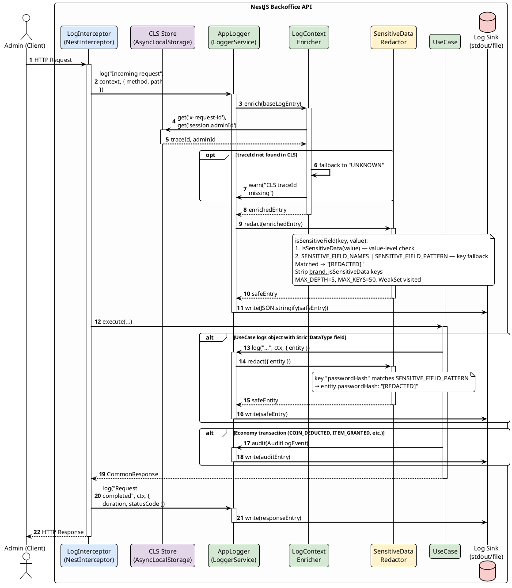

# Logger System Specification

**Project:** MVP Game Backoffice API  
**Stack:** NestJS, nestjs-cls, class-transformer

---

## 1. Overview & Security Context

ระบบ Logger เป็น Cross-Cutting Concern ที่ทำงานตั้งแต่ HTTP Request จนถึง Use Case โดยยึดหลัก 3 ข้อ:

1. **Structured Logging** — ทุก Log Entry เป็น JSON พร้อม `traceId`, `adminId`, `level`, `context`, `message`
2. **Sensitive Data Redaction** — ก่อน write log ทุกครั้ง ต้องผ่าน `SensitiveDataRedactor` เพื่อ mask field ที่เป็น `StrictDataType` (`__isSensitiveData === true`)
3. **Contextual Auto-Enrichment** — ดึง `traceId` และ `adminId` จาก CLS Store โดยอัตโนมัติผ่าน `LogContextEnricher` โดยไม่ต้อง prop drill

สอดคล้องกับ: OWASP A09 (Security Logging and Monitoring Failures)

---

## 2. Component Specification

### 2.1 Architecture Overview

| Component | Role | NestJS Integration Point |
| :--- | :--- | :--- |
| `AppLogger` | Custom Logger implement `LoggerService` | `app.useLogger()` ใน `main.ts` + Module DI |
| `LogInterceptor` | Auto-log Request/Response + Duration | Global `APP_INTERCEPTOR` |
| `LogContextEnricher` | ดึง CLS context (traceId, adminId) | Injected ใน `AppLogger` |
| `SensitiveDataRedactor` | Deep-scan + mask `StrictDataType` fields | Static utility (shared กับ Sanitize spec) |
| `LoggerModule` | NestJS module ที่ register ทั้งหมด | Import ใน `AppModule` |

### 2.2 IAppLogger Interface

```typescript
export interface IAppLogger {
  log(message: string, context?: string, metadata?: Record<string, unknown>): void;
  error(message: string, trace?: string, context?: string, metadata?: Record<string, unknown>): void;
  warn(message: string, context?: string, metadata?: Record<string, unknown>): void;
  debug(message: string, context?: string, metadata?: Record<string, unknown>): void;
  audit(event: AuditLogEvent): void;
}
```

### 2.3 AuditLogEvent Type (Economy Transactions)

```typescript
export interface AuditLogEvent {
  traceId: string;
  adminId: string;
  event: string;
  entityType: string;
  entityId: string;
  delta: Record<string, number>;
  previousValue: number;
  newValue: number;
}
```

### 2.4 Structured Log Entry Format

```json
{
  "level": "info",
  "timestamp": "2026-05-10T11:54:00.000Z",
  "traceId": "req-uuid-1234",
  "adminId": "admin-uuid-5678",
  "context": "DeductPangCoinUseCase",
  "message": "Coin deduction executed",
  "metadata": {
    "playerId": "player-uuid-9012",
    "amount": 500
  }
}
```

### 2.5 Audit Log Entry Format

```json
{
  "level": "audit",
  "timestamp": "2026-05-10T11:54:00.000Z",
  "traceId": "req-uuid-1234",
  "adminId": "admin-uuid-5678",
  "event": "COIN_DEDUCTED",
  "entityType": "Player",
  "entityId": "player-uuid-9012",
  "delta": { "pangCoin": -500 },
  "previousValue": 2000,
  "newValue": 1500
}
```

### 2.6 SensitiveDataRedactor Contract

> **Canonical algorithm definition อยู่ที่:** `docs/specs/security/02-sanitize-response/README.md` Section 2.6  
> Logger spec ใช้ `redact()` method เท่านั้น

```typescript
export class SensitiveDataRedactor {
  static redact<T extends object>(payload: T): T;
  // Detection ใช้ isSensitiveField(key, value) ซึ่งรวม 2 ชั้น:
  //   1. isSensitiveData(value)  → value-level check (class wrapper StrictDataType)
  //   2. SENSITIVE_FIELD_NAMES / SENSITIVE_FIELD_PATTERN → key-name fallback (primitive cast)
  // - Replace matched field values → "[REDACTED]"
  // - Strip __brand, __isSensitiveData keys จาก output
  // - Guards: MAX_DEPTH=5, MAX_KEYS_PER_LEVEL=50, WeakSet visited (circular-safe)
  // Full algorithm: docs/specs/security/02-sanitize-response/README.md Section 2.6
}
```

### 2.7 Log Levels

| Level | Usage | Production |
| :--- | :--- | :--- |
| `log` | Normal operations, request success | ✅ Active |
| `warn` | Non-critical issues, fallback triggered | ✅ Active |
| `error` | Caught errors, failed operations | ✅ Active |
| `debug` | Development-only details | ❌ Disabled |
| `audit` | Economy transaction audit trail | ✅ Always on |

### 2.8 NestJS Registration

```typescript
// main.ts
const app = await NestFactory.create(AppModule, { bufferLogs: true });
app.useLogger(app.get(AppLogger));

// logger.module.ts
@Module({
  providers: [
    AppLogger,
    LogContextEnricher,
    {
      provide: APP_INTERCEPTOR,
      useClass: LogInterceptor,
    },
  ],
  exports: [AppLogger],
})
export class LoggerModule {}
```

---

## 3. Sequence Diagram

Flow การทำงานของ Logger ตั้งแต่ HTTP Request เข้ามาจนถึง Use Case



---

## 4. Error Appendix

| Scenario | Log Level | Behavior |
| :--- | :--- | :--- |
| `StrictDataType` field detected in log payload | `warn` + auto-redact | ตัดค่าออกก่อน write, log warning แนบ context |
| CLS `traceId` / `adminId` ไม่พบ | `warn` | ใช้ fallback `"UNKNOWN"` แทน |
| Economy transaction executed | `audit` | บังคับ write เสมอ ไม่มี level filter |
| Internal error with stack trace | `error` | Stack trace write to log เท่านั้น ไม่ส่งถึง client (OWASP A05) |
| Audit log write failure | `error` | Retry 1 ครั้ง ถ้ายังล้มเหลว → process-level alert |
