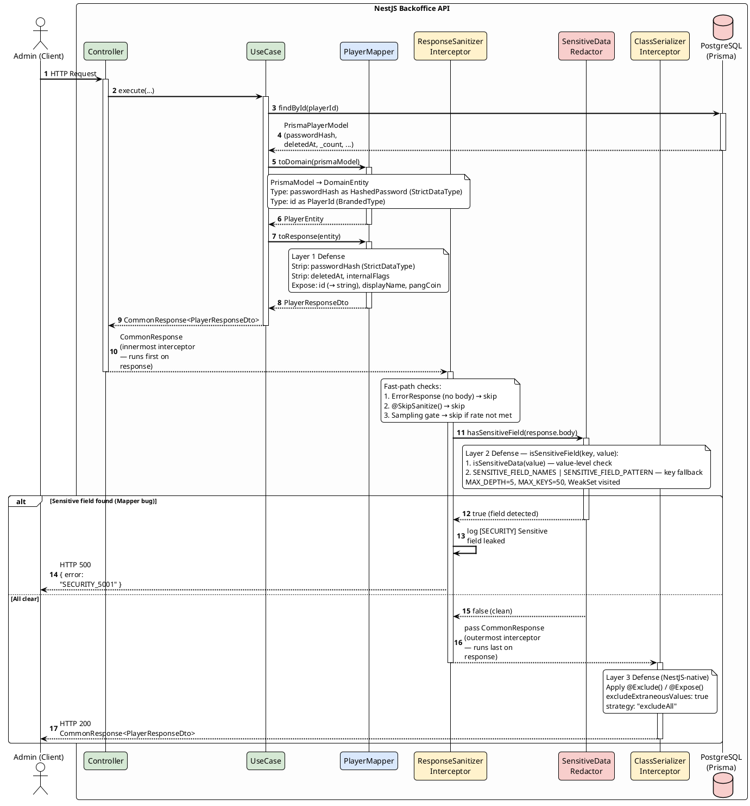

# Sanitize Response Body Specification

**Project:** MVP Game Backoffice API  
**Stack:** NestJS, class-transformer, class-validator

---

## 1. Overview & Security Context

Response Sanitization Pipeline ป้องกัน Data Leakage (OWASP A02, A04) โดยมีหลักการ:

1. **Mapper Pattern (Mandatory)** — Raw Prisma Model ห้ามถึง HTTP Response เด็ดขาด ทุก Entity ต้องผ่าน Mapper ก่อน
2. **StrictDataType Stripping** — field ที่เป็น `StrictDataType` (compile-time phantom type) ต้องถูก strip ที่ชั้น Mapper, ตรวจจับ runtime ผ่าน `SENSITIVE_FIELD_NAMES` / `SENSITIVE_FIELD_PATTERN`
3. **ClassSerializerInterceptor (NestJS-native)** — บังคับ `@Exclude()` + `@Expose()` บน Response DTO เป็น last line of defense
4. **Whitelist-Only Strategy** — `excludeExtraneousValues: true` + `strategy: 'excludeAll'` ทุก field ที่ไม่ `@Expose()` ถูก drop ทิ้ง

Pipeline:

```
PrismaModel → Mapper.toDomain() → DomainEntity → Mapper.toResponse() → ResponseDto → CommonResponse<ResponseDto>
```

---

## 2. Component Specification

### 2.1 Architecture Overview

| Component | Role | NestJS Integration Point |
| :--- | :--- | :--- |
| `IMapper<TSource, TDomain, TResponse>` | Generic mapper interface (contract) | ใช้ใน Repository / UseCase layer |
| `ClassSerializerInterceptor` | Enforce `@Exclude()`/`@Expose()` บน Response DTO | Global `APP_INTERCEPTOR` |
| `ResponseSanitizerInterceptor` | Runtime guard ตรวจ sensitive field leak ผ่าน field-name pattern | Global `APP_INTERCEPTOR` (innermost — process response ก่อน ClassSerializer) |
| `SensitiveDataRedactor` | Shared static utility (ใช้ร่วมกับ Logger spec) | Static utility |

### 2.2 IMapper Interface (Contract)

```typescript
export interface IMapper<TSource, TDomain, TResponse> {
  toDomain(source: TSource): TDomain;
  toResponse(domain: TDomain): TResponse;
}
```

### 2.3 Response DTO Pattern

ใช้ `@Exclude()` ระดับ class + `@Expose()` เฉพาะ field ที่อนุญาต (strict whitelist):

```typescript
import { Expose, Exclude } from 'class-transformer';

@Exclude()
export class PlayerResponseDto {
  @Expose()
  readonly id: string;

  @Expose()
  readonly displayName: string;

  @Expose()
  readonly pangCoin: number;

  // passwordHash: HashedPassword ← ไม่มี @Expose() = ถูก exclude เสมอ
  // deletedAt, internalFlag ← ไม่มี @Expose() = ถูก exclude เสมอ
}
```

### 2.4 Global Interceptor Registration & Ordering

NestJS `APP_INTERCEPTOR` chains interceptors ตามลำดับที่ register. Provider ที่ register **ก่อน** จะเป็น outermost และ **process response ทีหลัง** ส่วน Provider ที่ register **หลัง** จะเป็น innermost และ **process response ก่อน**.

**Execution order บน response path:**
```
handler → ResponseSanitizerInterceptor (innermost) → ClassSerializerInterceptor (outermost) → client
```

```typescript
// app.module.ts
@Module({
  providers: [
    {
      provide: APP_INTERCEPTOR,
      useFactory: (reflector: Reflector) =>
        new ClassSerializerInterceptor(reflector, {
          excludeExtraneousValues: true,
          strategy: 'excludeAll',
        }),
      inject: [Reflector],
    },
    {
      provide: APP_INTERCEPTOR,
      useClass: ResponseSanitizerInterceptor,
    },
  ],
})
export class AppModule {}
```

> **หมายเหตุลำดับ:** `ResponseSanitizerInterceptor` ต้อง register **หลัง** `ClassSerializerInterceptor` เสมอ เพื่อให้ Layer 2 scan DTO object ที่ยังมี field ครบก่อนที่ `ClassSerializerInterceptor` จะ serialize เป็น plain object

### 2.5 ResponseSanitizerInterceptor Contract

Runtime guard สำหรับ sensitive field ที่อาจหลุดรอด Mapper (defensive layer):

```typescript
// Fast-path 1: ErrorResponse ไม่มี body → skip scan ทันที
// if (!response.success || response.body == null) → pass through

// Fast-path 2: SkipSanitize decorator → skip scan ทันที
// if (this.reflector.get(SKIP_SANITIZE_KEY, handler)) → pass through

// Sampling gate (production performance guard):
// if (NODE_ENV === 'production' && Math.random() > SANITIZER_SCAN_RATE) → pass through
// SANITIZER_SCAN_RATE default: 1.0 (non-production), configurable via env (production)

// Scan:
// SensitiveDataRedactor.hasSensitiveField(response.body)
// → true  → throw InternalServerErrorException({ error: 'SECURITY_5001' })
//          → log: [SECURITY] Sensitive field leaked past Mapper: { field, context }
//          → ห้ามส่ง body ออกไปเด็ดขาด
// → false → pass through
```

### 2.6 SensitiveDataRedactor Algorithm (Canonical — shared กับ Logger spec)

`SensitiveDataRedactor` เป็น static utility ที่ใช้ร่วมกัน ณ จุดนี้คือ **single source of truth** สำหรับ algorithm:

#### Runtime Detection Strategy

Detection ใช้ **2 ชั้นรวมกัน** เพื่อรองรับทั้ง current implementation (primitive + `as` cast) และ future implementation (class wrapper):

**ชั้นที่ 1 — Value-level check (ผ่าน `isSensitiveData` จาก `brand.type.ts`)**  
ใช้เมื่อ `StrictDataType` ถูก implement เป็น class wrapper ที่มี `__isSensitiveData: true` เป็น runtime property จริง:

```typescript
import { isSensitiveData } from '@common/types/brand.type';
// isSensitiveData(value) → true เมื่อ value เป็น object ที่มี __isSensitiveData === true
```

**ชั้นที่ 2 — Key-name pattern matching (fallback)**  
ใช้เสมอสำหรับ primitive-based `StrictDataType` (string + `as` cast) ที่ไม่มี runtime property:

```typescript
const SENSITIVE_FIELD_PATTERN = /Hash$|Token$|Key$|Secret$|Otp$|Password/i;

const SENSITIVE_FIELD_NAMES = new Set([
  'passwordHash', 'apiKey', 'jwtToken', 'refreshToken',
  'accessToken', 'otpSecret', 'privateKey', 'clientSecret',
]);
```

**Combined check — ใช้ในทุก scan:**

```typescript
function isSensitiveField(key: string, value: unknown): boolean {
  return isSensitiveData(value)
    || SENSITIVE_FIELD_NAMES.has(key)
    || SENSITIVE_FIELD_PATTERN.test(key);
}
```

#### Scan Guards

| Guard | Value | หมายเหตุ |
| :--- | :--- | :--- |
| `MAX_DEPTH` | `5` | ป้องกัน deep nesting scan |
| `MAX_KEYS_PER_LEVEL` | `50` | ป้องกัน wide object scan |
| `WeakSet visited` | per-call | ป้องกัน circular reference infinite loop |

#### `hasSensitiveField(obj, depth, visited)` — ใช้ใน ResponseSanitizerInterceptor

```typescript
static hasSensitiveField(
  obj: unknown,
  depth = 0,
  visited = new WeakSet<object>(),
): boolean {
  if (depth > MAX_DEPTH) return false;
  if (obj == null || typeof obj !== 'object') return false;
  if (visited.has(obj as object)) return false;
  visited.add(obj as object);

  const keys = Object.keys(obj as object);
  for (let i = 0; i < Math.min(keys.length, MAX_KEYS_PER_LEVEL); i++) {
    const key = keys[i];
    const val = (obj as any)[key];
    if (isSensitiveField(key, val)) return true;
    if (Array.isArray(val)) {
      for (const item of val) {
        if (this.hasSensitiveField(item, depth + 1, visited)) return true;
      }
    } else if (val != null && typeof val === 'object') {
      if (this.hasSensitiveField(val, depth + 1, visited)) return true;
    }
  }
  return false;
}
```

#### `redact(payload)` — ใช้ใน AppLogger (Logger spec)

```typescript
static redact<T extends object>(payload: T, depth = 0, visited = new WeakSet<object>()): T {
  if (depth > MAX_DEPTH) return payload;
  if (payload == null || typeof payload !== 'object') return payload;
  if (visited.has(payload)) return payload;
  visited.add(payload);

  const result: Record<string, unknown> = {};
  const keys = Object.keys(payload as object);
  for (let i = 0; i < Math.min(keys.length, MAX_KEYS_PER_LEVEL); i++) {
    const key = keys[i];
    if (key === '__brand' || key === '__isSensitiveData') continue;
    const val = (payload as any)[key];
    if (isSensitiveField(key, val)) {
      result[key] = '[REDACTED]';
    } else if (Array.isArray(val)) {
      result[key] = val.map(item =>
        item != null && typeof item === 'object' ? this.redact(item, depth + 1, visited) : item,
      );
    } else if (val != null && typeof val === 'object') {
      result[key] = this.redact(val, depth + 1, visited);
    } else {
      result[key] = val;
    }
  }
  return result as T;
}
```

### 2.7 Sanitization Pipeline (Layered Defense)

```
Layer 1: Mapper.toResponse()
  → Strip sensitive fields ชื่อตรง SENSITIVE_FIELD_NAMES / SENSITIVE_FIELD_PATTERN
  → Strip internal Prisma fields (deletedAt, _count)
  → Return typed ResponseDto

Layer 2: ResponseSanitizerInterceptor
  → Fast-path: skip ถ้า ErrorResponse, SkipSanitize, หรือ sampling gate
  → Runtime scan: SensitiveDataRedactor.hasSensitiveField(body)
  → If found → SECURITY_5001 error + block response

Layer 3: ClassSerializerInterceptor (NestJS-native)
  → @Exclude() class-level + @Expose() field-level
  → excludeExtraneousValues: true (drop unknown fields)
  → strategy: 'excludeAll' (opt-in only)
```

### 2.8 @SkipSanitize() Decorator

ใช้สำหรับ endpoint ที่ไม่ต้องการ Layer 2 scan เช่น health check, metrics, หรือ endpoint ที่คืน stream/binary:

```typescript
export const SKIP_SANITIZE_KEY = 'SKIP_SANITIZE';

export const SkipSanitize = () => SetMetadata(SKIP_SANITIZE_KEY, true);
```

```typescript
@SkipSanitize()
@Get('/health')
healthCheck(): HealthCheckResult { ... }
```

> **กฎ:** ต้องได้รับ code review approval ก่อนใช้ `@SkipSanitize()` บน endpoint ที่คืน business data เสมอ

---

## 3. Sequence Diagram

Flow ตั้งแต่ UseCase คืน DomainEntity ผ่าน Mapper จนถึง HTTP Response



---

## 4. Error Appendix

| Scenario | HTTP Status | Error Code | Trigger |
| :--- | :--- | :--- | :--- |
| Sensitive field พบใน response body | 500 | `SECURITY_5001` | `ResponseSanitizerInterceptor` ตรวจพบ field ชื่อตรง `SENSITIVE_FIELD_NAMES` หรือ `SENSITIVE_FIELD_PATTERN` |
| Entity ถึง interceptor chain โดยไม่ผ่าน Mapper | 500 | `SECURITY_5002` | Field ชื่อ sensitive พบใน body — Mapper ถูก bypass |
| `ClassSerializerInterceptor` strip unknown field | ไม่มี error | — | Drop silently, response ออกปกติ |

---

## 5. Database Appendix

Pipeline ไม่ query database โดยตรง แต่ทุก Mapper ต้องจัดการ:

| Field Pattern | Action |
| :--- | :--- |
| `deletedAt`, `updatedAt` | Strip ถ้า Response DTO ไม่ต้องการ |
| `passwordHash`, `*Token`, `*Key`, `*Secret` | Strip เสมอ (StrictDataType) |
| `_count`, Prisma relation fields | Strip เสมอ |
| `id` (BrandedType → string) | Unwrap เป็น primitive string ก่อน Expose |
